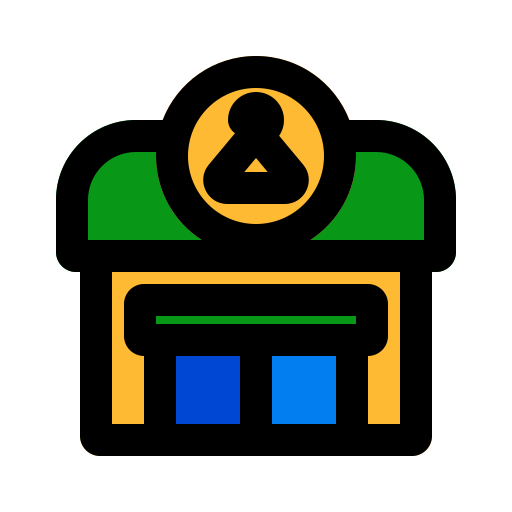

# 🛍️ 쇼핑몰 프로젝트

React + Node.js 기반 풀스택 쇼핑몰 프로젝트입니다.  
JWT 인증 기반 로그인, 상품 구매, 찜하기, 후기 작성 등 전자상거래의 기본 기능을 구현하였으며,  
AWS를 통한 배포와 GitHub Actions 기반 CI/CD 자동화를 구축하였습니다.

## :rocket: 테스트 어드민 계정

- ID: admin@test.com
- PW: 123456

---

## 📸 스크린샷

### 🏠 메인 페이지

### 🧑‍💼 사용자 기능

- ✅ JWT 기반 로그인 및 회원 인증
- ✅ 상품 목록 조회 (무한스크롤, 페이지네이션)
- ✅ 상품 상세 보기
- ✅ 장바구니 기능
- ✅ 찜하기 기능 (좋아요)
- ✅ 아임포트를 이용한 실제 결제 기능 (테스트 결제 연동)
- ✅ 후기(리뷰) 작성 / 수정 / 삭제 (CRUD)

### 🛠️ 관리자(어드민) 기능

- ✅ 상품 및 상품 옵션 등록 / 수정 / 삭제 (CRUD)
- ✅ 카테고리 관리 (CRUD)
- ✅ 상품/주문 데이터 관리
- ✅ Antd chart 이용한 매출 조회

---

## 🛠 사용 기술

### 💻 프론트엔드

- **React.js**
- **Redux Toolkit** – 상태 관리
- **Tailwind CSS**, **Ant Design** – UI 구성
- **React Router** – 라우팅
- **Axios** – API 통신
- **Infinite Scroll** – 무한 스크롤 구현

### 🌐 백엔드

- **Node.js**
- **Express**
- **JWT** – 인증 및 토큰 관리
- **MySQL** – 데이터베이스
- **Sequelize** – ORM

### ☁️ 인프라 & 배포

- **AWS EC2** – 백엔드 서버 호스팅
- **AWS S3** – 상품 및 프로필 이미지 저장
- **AWS RDS (MySQL)** – 데이터베이스 관리
- **GitHub Actions** – CI/CD 자동화
- **Certbot + Nginx** – HTTPS 적용

---

## 🚀 배포 주소

- **프론트엔드**: [https://my-shop.shop/](https://my-shop.shop/)
- **백엔드 API**: [https://my-shop.shop/api](https://my-shop.shop/api)
